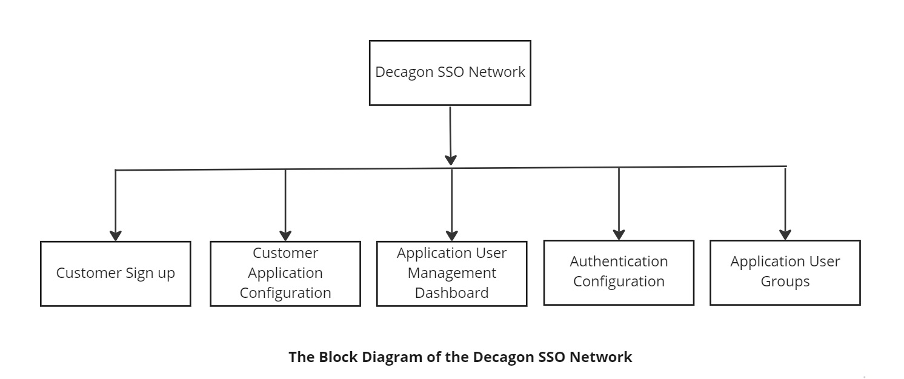
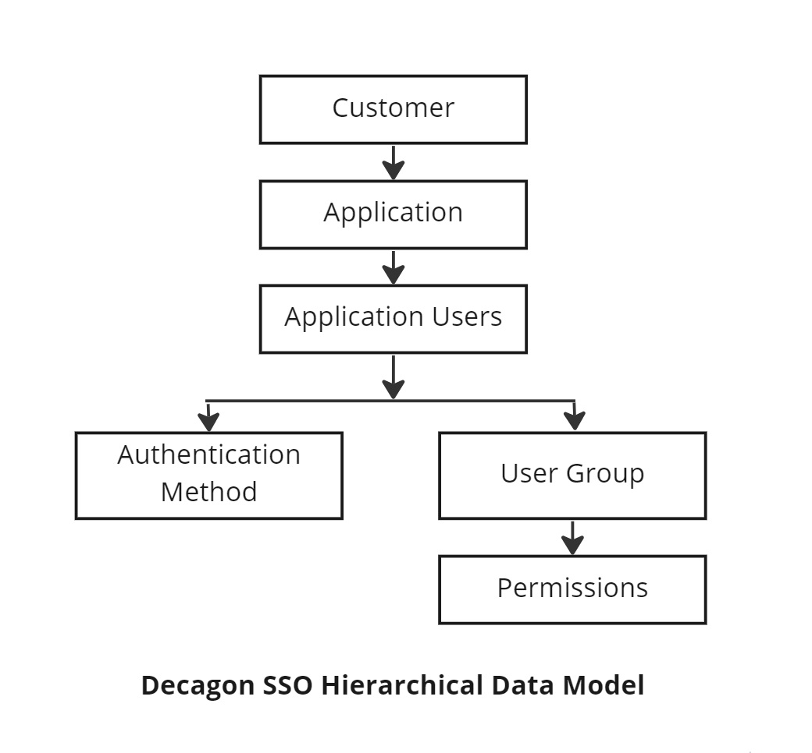
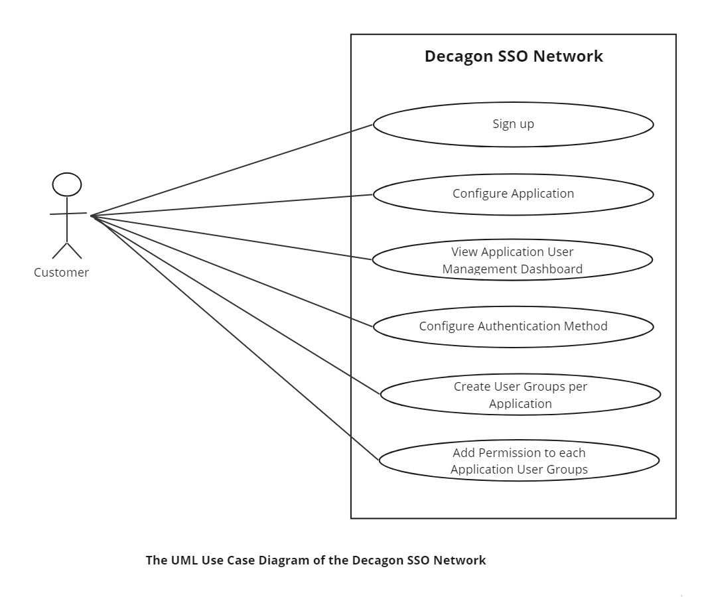
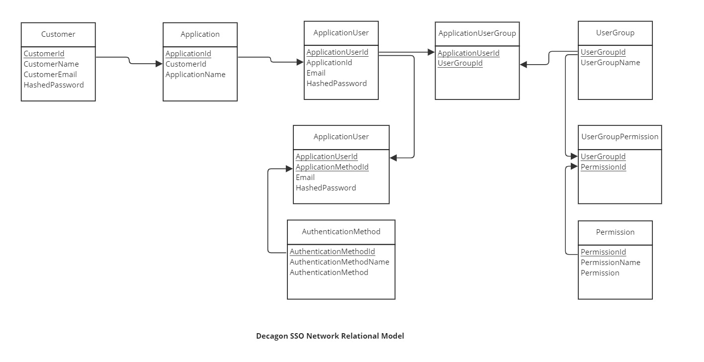

# Decagon Single SingOn (SSO) Network Design

Please go through the project [README](README.md) for the full information about this project.

The Decagon single sign-on (SSO) network allows Decagon customers to add authentication and authorization functions to their applications with just a few clicks.

Users can configure callback URL on the Decagon SSO dashboard and configure the login/registration methods and 2FA.

## The Decagon SSO Features:

1. Customers can sign up on the SSO network to configure their applications.
2. Each customer application is entitled to a user management dashboard to see all its users.
3. The customer can configure the supported authentication method. We can support basic auth (username/email & password) and OAuth 2. This is the method their users would use to login/sign up when they click on sign up or login on their website.
4. The customer can create different customer groups per application and add permissions to each group.

## Entities within the Decagon SSO Network 

1. Decagon SSO Customer
2. Customer Application
3. Application User
4. Authentication Method
5. Application User Group
6. User Group Permissions

The Decagon SSO Block Diagram is shown below:

The Decagon SSO Hierarchical Data Model is shown below:

The Decagon SSO Use Case Diagram is shown below:

The Decagon SSO Entity Relationship Diagram is shown below:

The Decagon SSO Relational Model is shown below:

**Design Approach**
The above design can be implemented either as a monolithic or microservices system.

The monolithic approach is excellent for proof of concept and rapid development, because it is easy to implement pretty rapidly.

To scale such a system easily, the entire REST API is deployed on Docker and orchestrated using Kubernetes. As the workload increases beyond certain treshold, more nodes are spun up for the system to scales out, and when the workload drops, the nodes are scaled in.
The database nodes can easily be scaled up and down as well based on workload as well. Read replicas can equally be created to help hadle read workloads.

**Design loosely-couped systems**

For more resilience and scalability, the monolith system which is tightly coupled should be broken down into momre loosely-coupled Microservices, possibly along the lines of the different entities identified within the system, namely
> 1. Decagon SSO Customer
> 2. Customer Application
> 3. Application User
> 4. Authentication Method
> 5. Application User Group
> 6. User Group Permissions

Notification or queuing services might equally be place between different microservices to buffer data and creat higher levels of resilience. Similarly, redundant copies of the solution and data can be implemented and keptin sync.

**Deployment plan**

For the deployment, I would make sure I employ DevOps and DevSecOps best practices which include automating everything as much as possible. This is mainly to ensure a consistent way of getting things done, and reduce the likelihood of human errors being introduced into the system. Security measures are equally entrenched into every aspected of the deployment proces. 
>1. I would implement a CI/CD pipeline which will be triggered either at regular intervals, or based on commits. The pipeline would include an automated build, testing, deployment, monitoring, and observerbility. 
> 2. I would sure continuous monitoring and observerbility like already mentioned above
> 3. I would implement infrastructure as code (Iac) to make it easy to spin up and tear down infrastructure in a consistent manner and with a lot of speed and convenience,reducing possibility of introducing human errors.

**Design Pattern**

I have taken the Data-Driven Design approach which can be implemented using a number of Software Architectural patterns including the Layered and MicroServices Patterns as already described above.

My approach toapplicationsecurity is simple. Security measures are implemented at every stage of the Software Development Life Cycle SDCL. Everyone onthe teammust be included in security and best practices. DevSeOps practices are entrenched each step ofthe way. Intrusion detection and prevention mechanisms and services are equally deployed along with firewalls and DDoS prevention services.

**Taking advantage of concurrency and multi-core processors**

Taking advantage of concurrency and multi-core processors will be achieved via multithreading, and asynchronous invocations.

**How I would setup my agile team**

For the purpose of pure agility, using the Microservices Software Architecture approaoch, I would breakdown the team into small groups and assign each team a microservice to implement.

